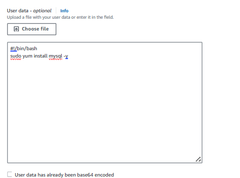

# Deploy a three tier web application in the cloud
scalability, High availability, Fault tolerant, security, Improved performance services using are : VPC, Amazon EC2, RDS, AWS Load balancer

## AWS 3-tier Architecture: VPC Creating VPC for our project, “cloud-Diary”

1. Go to AWS management console >> vpc services >> click on create vpc >> vpc and more

- We’re creating a VPC, naming our project “cloud-Diary” with a CIDR block of 10.0.0.0/16.

- To increase the availability of the project “cloud-fortress”, we’re using two AZs (us-east-1a and us-east-1b), two public subnets, and four private subnets.

Quick Lookup to visualize the resources about to be allocated.

Basic Manual Configurations

Enable auto-assign IPv4

- Once all the resources have been created, we need to make sure we ‘Enable auto-assign public IPv4 address’ for BOTH public subnets so we can access its resources via the Internet.

Change the Main Route Table

- When a VPC is created, it comes with a default route table as its ‘main table.’ But, we want our public route table to serve as the main table, so select the “cloud-Diary-rtb-public” from the Route tables dashboard and set it as the main table under the ‘Actions’ dropdown menu as shown in the image.

Deploying a NAT Gateway

overview of NAT Gateway

- NAT gateway acts as a security checkpoint. It allows resources within a private network (lacking public IP addresses) to reach the internet for essential tasks like software updates or data downloads. However, the NAT gateway functions like a one- way street. It blocks incoming internet connections, safeguarding private resources from unauthorized access. This creates a secure environment

for your network while enabling necessary communication with the outside world.

Now, Let’s create a NAT Gateway, Navigate to ‘NAT Gateways’ and create a new gateway called nat-public. Select one of the public subnets, allocate an elastic IP, and create the gateway.

VPC >> NAT gateways >> Create NAT gateway

Setting up NAT Gateway

Setting one Private Route Table

Select any one of the private route tables and adjust the name to something like ‘cloud-Diary-private.’ This will be our private route table.

Editing Subnet Associations

Now we can associate the updated table ”cloud-Diary-private” with all four private subnets (- subnet-private1, -subnet- private2, -subnet-private-3, — subnet-private4)

Adding NAT Gateway

Edit the routes, Add a new route with Target set to NAT Gateway and select the nat-public for the dropdown menu.

## AWS 3-tier Architecture: Web Tier

<Architecture diagram pending>

Tier 1, The Presentation Tier

- The Web Tier, also known as the ‘Presentation’ tier, is the environment where our application will be delivered for users to interact with. For Cloud Diary, this is where we will launch our web servers that will host the frontend of our application.

Setting up Launch Template

Now Let’s create a launch template that will be used by our ASG to dynamically launch EC2 instances in our public subnets.

In the EC2 console, navigate to ‘Launch templates’ under the ‘Instances’ sidebar menu.

 

Create a new security group with inbound SSH, HTTP, and HTTPS rules. Make sure the proper cloud-Diary is selected.

Under the Advanced details, on User data section we need to paste in our script that installs an Apache web server and a basic HTML web page.

## Creating an Auto Scaling Group

- To ensure high availability for our Cloud Diary app and limit single points of failure, we will create an ASG that will dynamically provision EC2 instances, as needed, across multiple AZs in our public subnets.

Navigate to the ASG console from the sidebar menu and create a new group. Use the cloud-Diary- template launch template that we have created in the previous step.

Next, we will set up a load balancer that will be responsible for evenly distributing incoming traffic to our EC2 instances in the Web Tier, thereby enhancing availability.

<yet to update final output page>