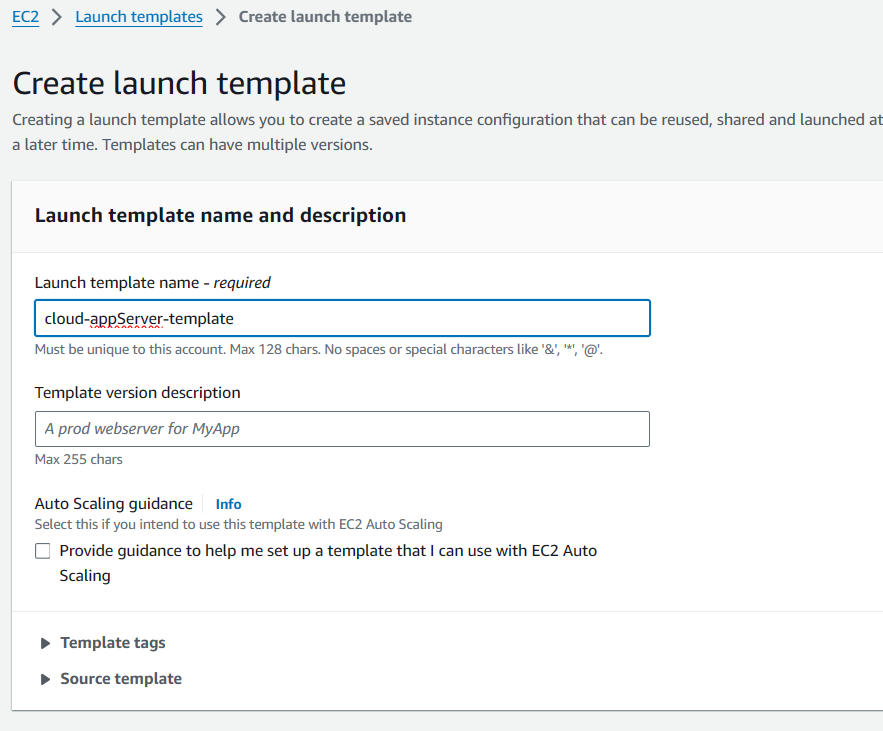
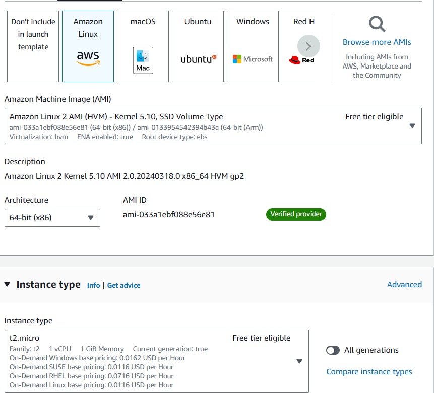
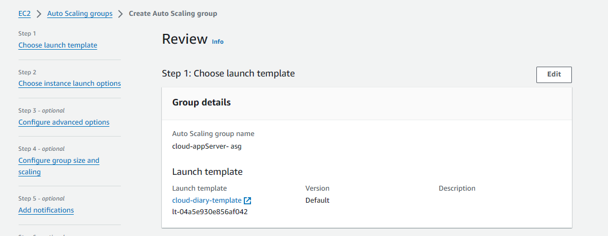
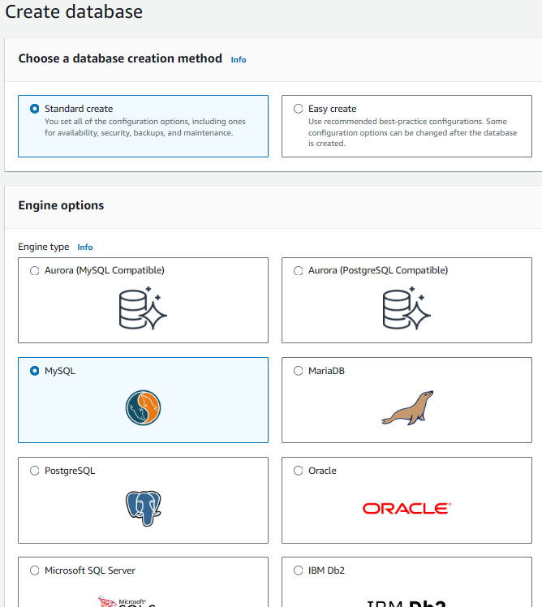
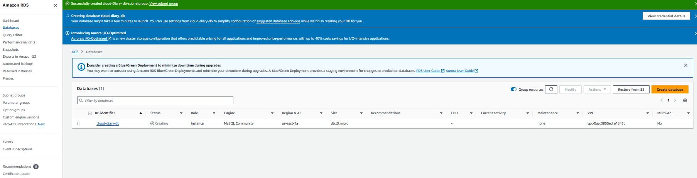

# Deploy a three tier web application in the cloud
scalability, High availability, Fault tolerant, security, Improved performance services using are : VPC, Amazon EC2, RDS, AWS Load balancer

## AWS 3-tier Architecture: VPC Creating VPC for our project, “cloud-Diary”

1. Go to AWS management console >> vpc services >> click on create vpc >> vpc and more

- We’re creating a VPC, naming our project “cloud-Diary” with a CIDR block of 10.0.0.0/16.

- To increase the availability of the project “cloud-fortress”, we’re using two AZs (us-east-1a and us-east-1b), two public subnets, and four private subnets.

Quick Lookup to visualize the resources about to be allocated.

Basic Manual Configurations

Enable auto-assign IPv4

- Once all the resources have been created, we need to make sure we ‘Enable auto-assign public IPv4 address’ for BOTH public subnets so we can access its resources via the Internet.

Change the Main Route Table

- When a VPC is created, it comes with a default route table as its ‘main table.’ But, we want our public route table to serve as the main table, so select the “cloud-Diary-rtb-public” from the Route tables dashboard and set it as the main table under the ‘Actions’ dropdown menu as shown in the image.

Deploying a NAT Gateway

overview of NAT Gateway

- NAT gateway acts as a security checkpoint. It allows resources within a private network (lacking public IP addresses) to reach the internet for essential tasks like software updates or data downloads. However, the NAT gateway functions like a one- way street. It blocks incoming internet connections, safeguarding private resources from unauthorized access. This creates a secure environment

for your network while enabling necessary communication with the outside world.

Now, Let’s create a NAT Gateway, Navigate to ‘NAT Gateways’ and create a new gateway called nat-public. Select one of the public subnets, allocate an elastic IP, and create the gateway.

VPC >> NAT gateways >> Create NAT gateway

Setting up NAT Gateway

Setting one Private Route Table

Select any one of the private route tables and adjust the name to something like ‘cloud-Diary-private.’ This will be our private route table.

Editing Subnet Associations

Now we can associate the updated table ”cloud-Diary-private” with all four private subnets (- subnet-private1, -subnet- private2, -subnet-private-3, — subnet-private4)

Adding NAT Gateway

Edit the routes, Add a new route with Target set to NAT Gateway and select the nat-public for the dropdown menu.

## AWS 3-tier Architecture: Web Tier

Tier 1, The Presentation Tier

- The Web Tier, also known as the ‘Presentation’ tier, is the environment where our application will be delivered for users to interact with. For Cloud Diary, this is where we will launch our web servers that will host the frontend of our application.

Setting up Launch Template

Now Let’s create a launch template that will be used by our ASG to dynamically launch EC2 instances in our public subnets.

In the EC2 console, navigate to ‘Launch templates’ under the ‘Instances’ sidebar menu.

 

Create a new security group with inbound SSH, HTTP, and HTTPS rules. Make sure the proper cloud-Diary is selected.

Under the Advanced details, on User data section we need to paste in our script that installs an Apache web server and a basic HTML web page.

## Creating an Auto Scaling Group

- To ensure high availability for our Cloud Diary app and limit single points of failure, we will create an ASG that will dynamically provision EC2 instances, as needed, across multiple AZs in our public subnets.

Navigate to the ASG console from the sidebar menu and create a new group. Use the cloud-Diary- template launch template that we have created in the previous step.

Next, we will set up a load balancer that will be responsible for evenly distributing incoming traffic to our EC2 instances in the Web Tier, thereby enhancing availability.

AWS 3-tier Architecture: Application Tier

The Application Tier is essentially where the heart of our Cloud Diary app lives. This is where the source code and core operations send / retrieve data to / from the Web and Database tiers.

Creating Application Server Launch Template

This template will define what kind of EC2 instances our backend services will use, so let’s create a new template called, ‘cloud-appServer-template.’ We will use the same settings as the cloud-Diary-template (Amazon 2 Linux, t2.micro-1GB, same key pair).

- Our security group settings are where things will differ. Remember, this is a private subnet, where all of our application source code will live. We need to take precautions so it cannot be accessible from the outside. We want to allow ICMP–IPv4 from the cloud-Diary-sg, which allows us to ping the application server from our web server.

- The application servers will eventually need to access the database, so we need to make sure the mySQL package is installed on each instance. In the ‘User data’ field under ‘Advanced details,’ paste in this script:

`#!/bin/bash` 
`sudo yum install mysql -y`

Creating Auto Scaling Group
Similar to the Web Tier, we’ll create an ASG from the cloud-appServer- template called, ‘cloud-appServer- asg.’

Make sure to select the cloud-Diary- vpc and the 2 private subnets (subnet- private1 and subnet-private2) as shown in the image down.

Now we’ll create another ALB that routes traffic from the Web Tier to the Application Tier. We’ll name it ‘cloud-appServer-alb.’

This time, we want the ALB to be ‘Internal,’ since we’re routing traffic from our Web Tier, not the Internet.

- We’ll also create another target group that will target our appServer EC2 instances.

- Confirm connectivity from the Web Tier
Our application servers are up and running. Let’s verify connectivity by pinging the application server from one of the web servers.

SSH into the web server EC2 and ping the private IP address of one of the app server EC2s.

If successful, you should get a repeating response like in the Image.

<have to attach output image here>

AWS 3-tier Architecture: Database Tier

3rd Tier, Database Tier
The database tier, also known as the data tier or data access tier, is the foundation of a 3-tier architecture responsible for storing, managing, and retrieving application data.

Creating a Database Security group
Our application servers need a way to access the database, so let’s first create a security group that allows inbound traffic from the application servers.

Create a new security group called, ‘cloud-Diary-db-sg.’ Make sure the cloud-Diary vpc is selected.

Now, we need to add inbound AND outbound rules that allow MySQL requests to and from the application servers on port 3306.

We’ll need to do the same for the cloud-Diary-appserver-sg.

Creating a DB subnet group

- In the RDS console, under the ‘Subnet groups’ sidebar menu, create a new subnet group called, ‘cloud-Diary- db-subnetgroup.’ Make sure the cloud-Diary-vpc is selected.

Select our two AZs (us-east-1 and us- east-2) and our private subnets (subnet-private3 and subnet- private4).

Creating a RDS Database

Under the RDS console and the ‘Databases’ sidebar menu, create a new database with a MySQL engine.

Choose the Free Tier Template

Name this database, ‘cloud-Diary- db,’ and create a master username and password (we’ll use this to log into our DB from the command line, so keep this info handy).

For ‘Instance configuration,’ we’ll use a db.t2.micro and leave the defaults for ‘Storage.’

For ‘Connectivity,’ we do not want to connect an EC2 instance but make sure the Cloud-Diary-vpc is selected.

Select the DB subnet group we created earlier. We also do not want to enable ‘Public access.’

Choose our cloud-Diary-db-sg security group and select us-east-1a as the preferred AZ.

Under ‘Additional configuration,’ provide the name of the database you want to create right on the initial setup (without dashes).

Leave the defaults for everything else and create the database (this may take a few minutes to fully provision).

Final Test, Checking Conectivity
Check appServer Connectivity
Connect to one of the web server and check if it can connect with app server with command, ping privateIPv4 Address. If it is working like in the image then You’re Done!

<yet to add output>
