# Deploy wordpress website on AWS using Docker

## Introduction

WordPress is a popular web hosting site that is very easy to use and setup. The platform allows users to create and setup websites for blogs, eCommerce stores, and other types of businesses. The popularity of WordPress has enabled it to be the web hosting platform of choice for over 40% of all the websites out there on the web!

Docker is a PaaS(Platform as a service) that uses local images to deliver software applications in the form of containers. Companies such as Google, Adobe, AT&T, PayPal… just to name a few all use Docker to build and manage their popular applications that are widely used around the globe. You can learn more here.

If you are someone who is looking to start a business and host your website on a safe and reliable platform, look no further than WordPress! Let's dive into the Cloud and get things going!

## requirements

What you will need

- AWS account
- Desire to learn something new

## Objectives

1. Launch EC2 instance on AWS
2. Connect to instance via SSH 
3. Install Docker on Instance 
4. Verify Docker is properly installed 
5. Install Docker Compose Service 
6. Verify Docker compose Service is successfully installed 
7. Create a New Directory for WordPress & Setup Docker Compose File
8. Start WordPress Container 
9. Access WordPress Site

### Step 1. Launch EC2 instance on AWS
- Login into your AWS account and type "EC2" in the search box to bring up the Instance management console.
- Choose a name of your liking for your instance and select the "Ubuntu Server 22.04 LTS(HVM)" for the AMI
- Create or select a key pair. If you are creating a new pair make sure to download it and save it to your local machine(saves to downloads folder by default depending on your machine).
- Open port "22" and "80" to allow traffic to and from the instance. Port 22 will allow us to be able to SSH into the instance.
- Leave the rest of the default settings as is and click "Launch" to officially deploy the instance.

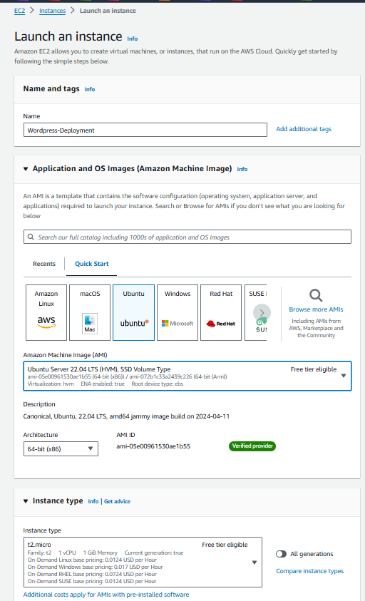

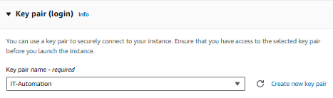

### 2. Connect to instance via SSH 
- SSH into the new deployed instance. Your instance window should look like mine

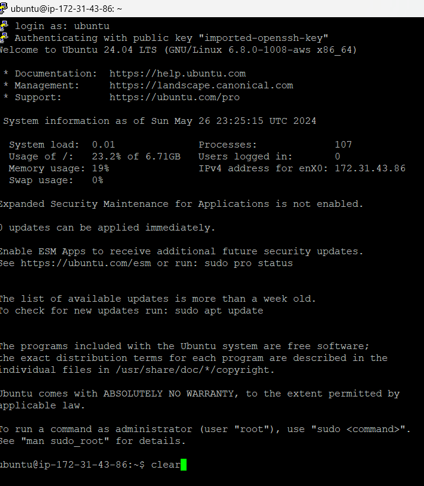

- After successfully connecting your local machine to the instance, we need to update the instance before we can go through the process of installing docker.
Run the following command:

`$ sudo apt update`

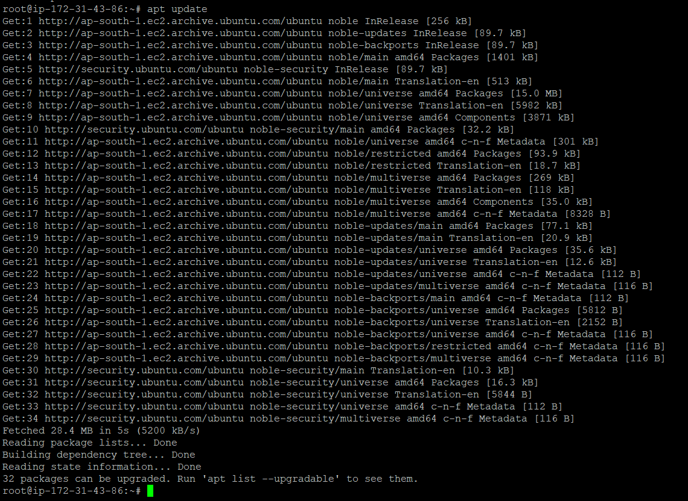

### 3. Install Docker on Instance 

- Now that the instance has been successfully updated with all new packages we can now start the docker installation.

- Run the following command to install docker:

`$ sudo apt-get install docker.io -y`

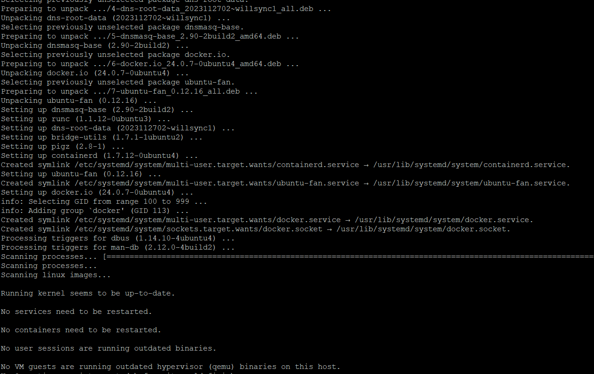

### 4. Verify Docker is properly installed 

In the previous step we ran the appropriate command to install docker. Let's verify that the installation was successful.
`$ docker --version`

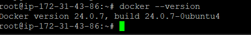

### 5. Install Docker Compose Service 

- Docker compose is a configuration tool use to define, deploy and manage docker containers using a YAML file.
The powerful and efficient advantage of Docker compose is that it enables engineers and developers to effortlessly build containers and destroy containers using a single command, thus saving them lots of time and energy.

- Run the following commands :

`$ sudo apt install docker-compose -y`

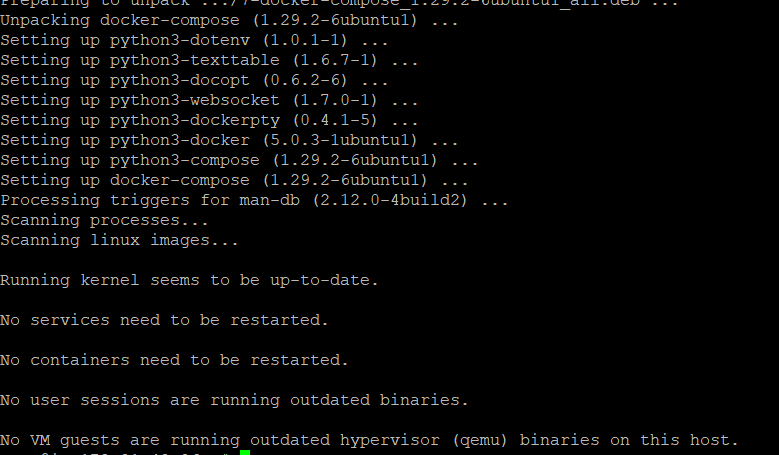

### 6. Verify Docker compose Service is successfully installed 

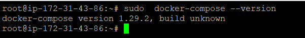

### 7. Create a New Directory for WordPress & Setup Docker Compose File
- We are going to create a new directory for WordPress. The Directory will contain our docker compose YAML file that will be use to contain all the necessary services needed to deploy WordPress.

- Create directory running the command "mkdir wordpress". Change directory "cd wordpress".
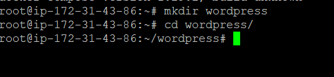

- On the CLI run the command "vim docker-compose.yml" and paste the following code into the YAML file, save and close the file.

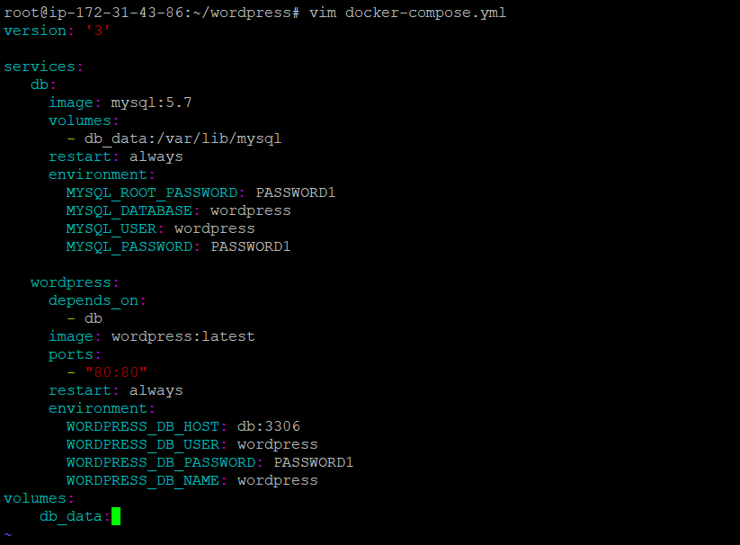

### 8. Start WordPress Container 
- Run the following command to start the WordPress Container:
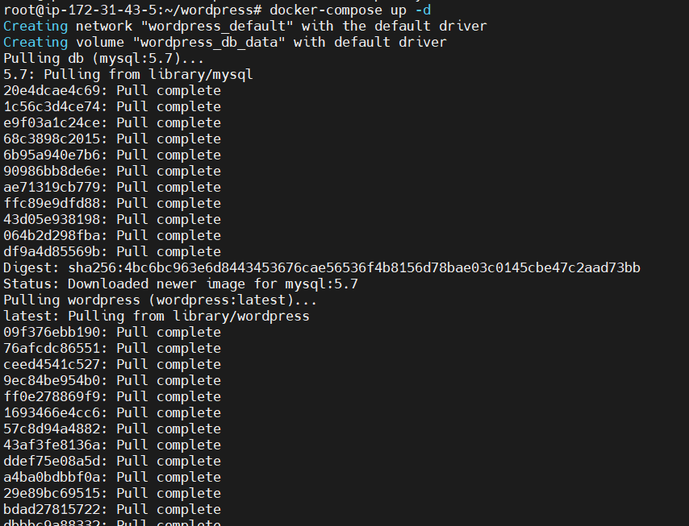

### 9. Access WordPress Site
- Navigate back to the instance console, copy and paste your instance public IP address into your web browser address bar. You should see the setup window for WordPress.

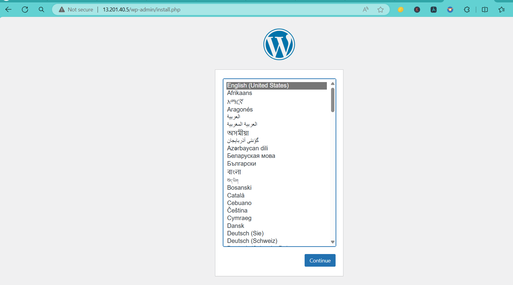
- You should see the WordPress installation screen. You can now follow the prompts to complete the installation.

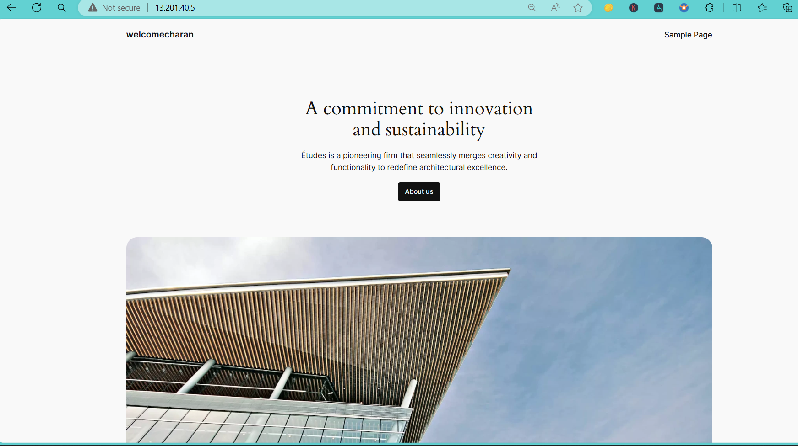

