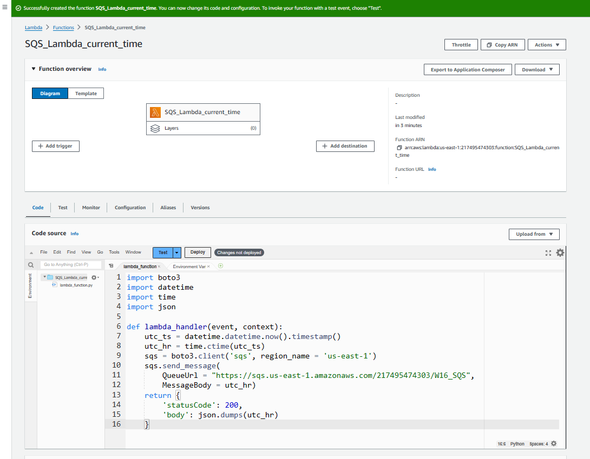
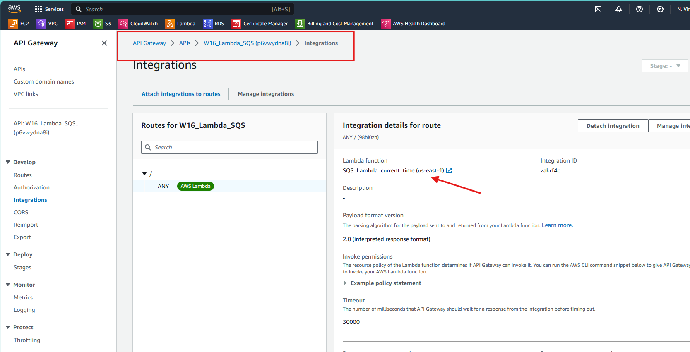

# Trigger, Function, Message
## Utilizing Amazon API Gateway to Invoke a Python AWS Lambda to Send a Message to Amazon SQS

**Pre-requisites**
- AWS account with admin user access
- Basic python knowledge
- IDE Configured with boto3 and awscli

**objectives**
- create standard SQS queue using Python
- create a Lambda function in the console with python3.7 runtime
- Modify the lambda to send a message to the SQS queue
- test the lambda function
- Create a API Gateway with HTTP API type trigger
- Test the trigger

Below is the architecture diagram for the same.
AWS Lambda and Amazon SQS automatically send logs and metrics to cloudwatch. We will setup the rest of the services, including Lambda role and permission policy.

## Create a standard SQS Queue using python

- Amazon Simple Queue Service (SQS) offers default standard queues that allow you to queue and then process a message. Standard queues offer a near-unlimited number of API calls per second with at-least-once message delivery. You can use Python and AWS’s SDK boto3 to create a script that will create a standard SQS queue.

- To create our Python script, we must first import boto3. To call the SQS service resource, we use sqs = boto3.resource(‘sqs’, region_name = ‘us-east-1’). Adjust the region name to the region in which you want to create the SQS queue. To create the queue, we must define a variable that uses the SQS create_queue action. This creates a standard queue and you can assign a queue name (required) and attributes (optional). In the code below, I have assigned the queue name of “W16_SQS” and the attributes DelaySeconds and VisibilityTimeOut. When creating the queue, a queue URL will be assigned and we want to print that for future use (alternatively, you could find the queue URL in the SQS console after the queue is created).

Below is my sqs , it is different for you.
`https://sqs.us-east-1.amazonaws.com/217495474303/W16_SQS`

![sqs aws image]](image.png)

## Create Custom IAMRole for Lambda Function

- Your Lambda function will need permission to send messages to the SQS queue. In the IAM console, click Roles then Create role. On the next screen, for Trusted entity type select AWS service, under Use Case select Lambda, then click Next

- We need to give our Lambda function permission to interact with the SQS queue. Search for the `AWSLambdaSQSQueueExecutionRole policy`. This policy has most of the permissions we need, but we will have to modify it a bit. After finding the policy, copy the JSON code and click Create policy. This will open up a new browser tab where you can create the policy.

policy creation

policy attachment

## Create Python Script to Send Message with Current Date and Time

- We want our Lambda function to send a message to SQS with the current date and time, so we need to create a script to do this. Using the boto3, datetime, time, and json libraries, we can create a Lambda function that gets the current date and time. The datetime.datetime.now().timestamp() action gets the current date and time in UTC string format. The result will look something like 1676934734. To make it more human-readable, we use time.ctime as this will give us the day of week, month, day, and time in an easy-to-read format. See the difference between the two:

- Next we will call the SQS boto3.client using sqs = boto3.client(‘sqs’, region_name = ‘us-east-1’). Substitute the region name for the region you want to create the SQS queue in. Next we want to send a message so we will use the sqs.send_message action that includes the queue URL that we got earlier and the body of the message. You could type a string for the MessageBody but here we are calling our human-readable UTC variable that we created to give us the current date and time in the message. We can use the default Lambda function return statement.

## Create a Python Lambda Function to Send a Message to the SQS Queue

- Lambda functions can run code in response to an event trigger. We want to create a Lambda function that will send a message to the SQS queue we just created. The message will contain the current UTC time, which is created by the Python script we wrote above.

- Navigate to the Lambda console and click Create function. Select Author from scratch. Under Basic information, give the function a name and select a runtime of Python 3.7 or higher. Leave the Architecture as the default x86_64. Under Permissions, expand the Change default execution role arrow. Select Use an existing role, then under the Existing role drop down, find the role you just created and select it. Click Create function.

- Under the Code tab, delete the existing code and paste in your Python code you just created to send the timestamp message. When your code is complete, click Deploy.

## Test Lambda Function Sending Message to SQS

- Lambda has several test templates to make sure your Lambda function is working correctly. Click on Test and select Create new event. Give the test event a name. Under Template, find the SQS template and click Save.

Now once you click on `test`

## Create an API Gateway with HTTP API Trigger

Lambda can have many different trigger types, including SQS. However, for this tutorial, we want an HTTP API to trigger our Lambda, which will then send our date and timestamp message to the SQS. To do this, navigate to the API Gateway console and click Create API. For Choose an API type, select HTTP API, then click Build.

Under Integrations select Lambda. Select your AWS Region and the Lambda function you created earlier. Give the API a name and click Next.

## Test the API Gateway Trigger

To test the API Gateway trigger, you simply click the Invoke URL and it should bring you to an HTTP webpage that displays your Lambda function message. If you see your date and timestamp message, you’re done!

That's it for this day. Hope you have some great learning. See you tommorrow with another project.
