# Integrating Python, Amazon API Gateway, Lambda, SQS, and SNS Services

- we will create an SNS topic and subscribe to the topic with a valid email address. We will then create a new Lambda function that is triggered when new messages arrive in the SQS queue from the last tutorial. When new messages arrive, the new Lambda will take those messages, and forward them to the SNS topic we create, and the user will receive an email notification with the message.

## pre-requisites

1. AWS account with Admin user access
2. Basic Python knowledge
3. IDE configured with Python, Boto3, and awscli
4. completion of Day 28

## Objectives

- Create a SNS topic using Python
- Subscribe to the SNS topic via an email address
- Create a custom IAM role for Lambda function
- Create a Lambda function that triggers when new messages arrive in an SQS queue
- Modify the lambda to publish the SQS message to an SNS topic
- You should receive the notification from the SNS subscription

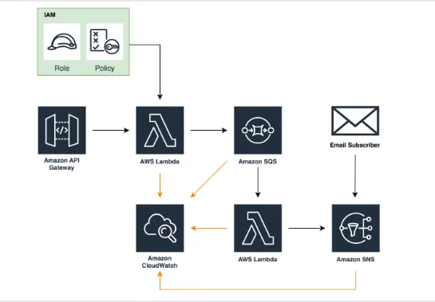

## Create an SNS Topic Using Python

Amazon’s Simple Notification Service (SNS) allows users to subscribe to a topic and receive messages from publishers. Publishers send a message to a topic which serves as an access point and communication channel. For this tutorial, we will write a Python script that creates an SNS topic. First import boto3, which is the Python SDK for AWS. We then want to define a variable that calls the SNS client. Lastly, we will use the create_topic action and assign it a name. I have assigned my topic name as “W16_SNS_topic.” Run this code in your IDE (I am using Amazon Cloud9), then navigate to the Amazon SNS console to see your newly created SNS topic.


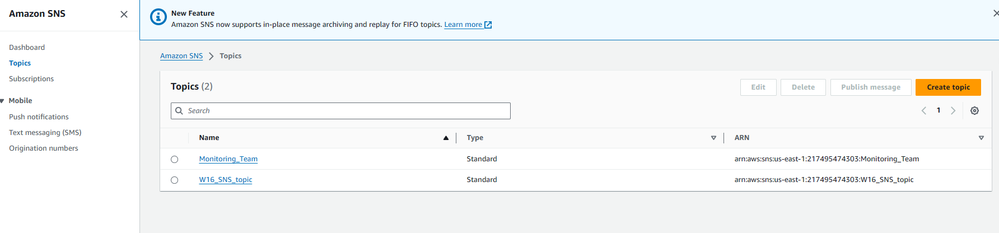

## Subscribe to the SNS Topic Via an Email Address

In the Amazon SNS console, click on the link for the SNS topic you just created. In the Subscriptions tab, you should see that you currently have no subscriptions to the topic. Click Create subscription.

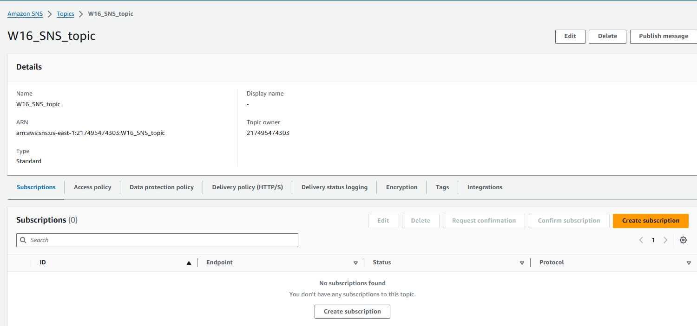

- Under Details, you will see that the ARN of your SNS topic is automatically assigned. We want to subscribe to the SNS topic with an email address, so under the Protocol section, select Email. Under Endpoint, enter a valid email address where you want to receive the SNS topic notification, then Create subscription.

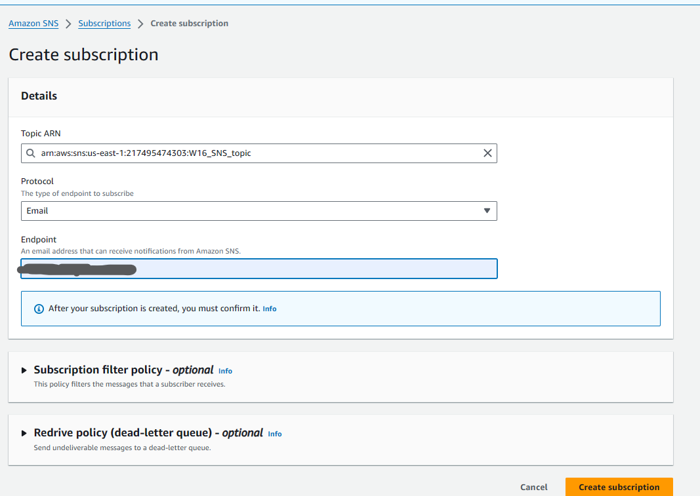

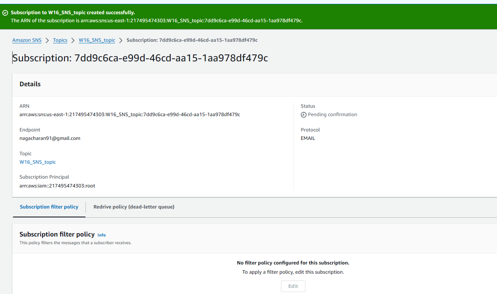

You will receive below in your mail box

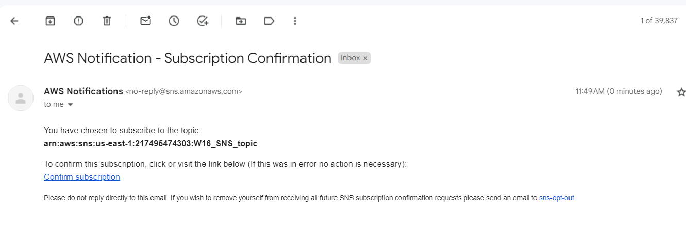

You must open the confirmation email and click Confirm subscription. Check your SPAM folder if you do not see the AWS Notification email.

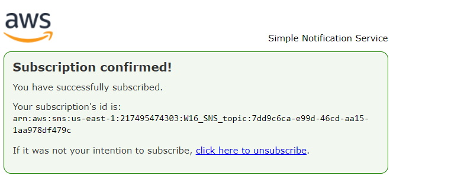

## Create Custom IAM Role for Lambda Function

Remember that Lambda functions need permission to interact with other AWS Resources. Let’s go ahead and create a custom IAM role for the new Lambda function that we will create in the next step. This role will allow the Lambda to interact with SQS and SNS.

Navigate to the IAM console, click Roles, then Create role. On the next screen, for Trusted entity type select AWS service, under Use case select Lambda, then click Next.

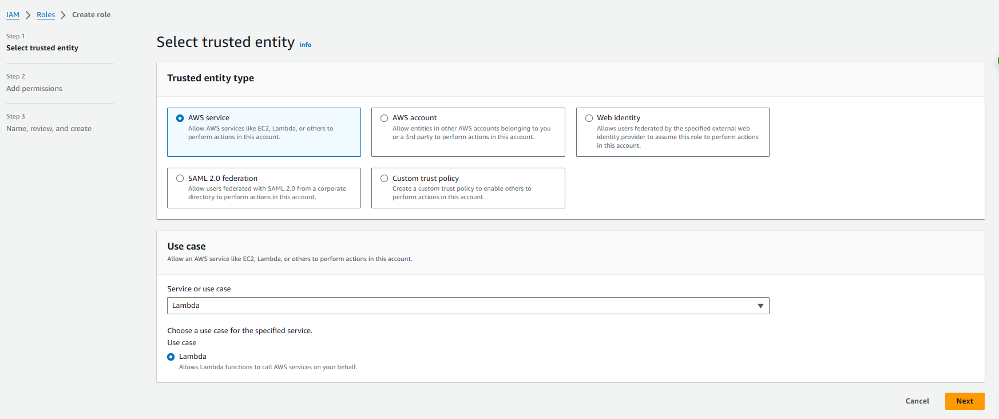

Click Create policy to create a custom policy that will allow the Lambda to read messages from the SQS queue and publish them to the SNS topic. This will open up a new browser tab where you can create the policy.

Under the JSON tab in the newly opened web browser , add code that will allow the Lambda to interact with the SQS queue and publish messages to the SNS topic.

```
{
	"Version": "2012-10-17",
	"Statement": [{
			"Effect": "Allow",
			"Action": [
				"sqs:ReceiveMessage",
				"sqs:SendMessage",
				"sqs:DeleteMessage",
				"sqs:GetQueueAttributes",
				"logs:CreateLogGroup",
				"logs:CreateLogStream",
				"logs:PutLogEvents"
			],
			"Resource": "*"
		},
		{
			"Effect": "Allow",
			"Action": [
				"sns:Publish"
			],
			"Resource": [
				"*"
			]
		}
	]
}
```

- After creating the permission policy, navigate back to the browser tab where you were creating the role. Refresh the policies and find the policy you just created. You may have to refresh a few times before it shows up. Select the policy and click Next.

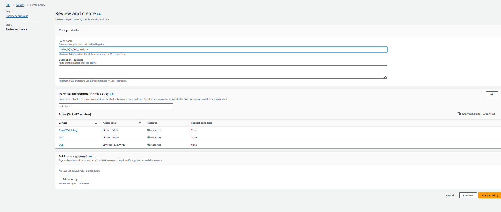

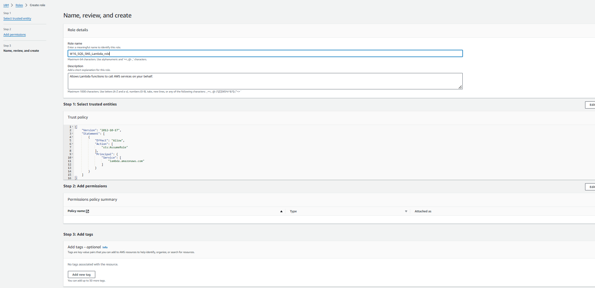

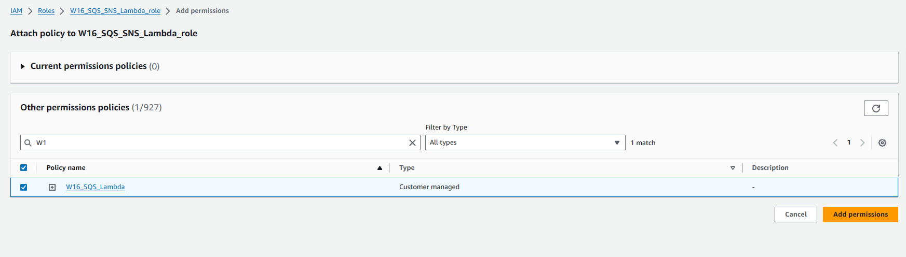

## Create a Lambda Function that Triggers When New Messages Arrive in an SQS Queue

-  In this tutorial, we will use the same SQS queue and Lambda function, but create an additional Lambda function that will be triggered by the SQS queue when a new message is received, and subsequently send the message to an SNS topic.

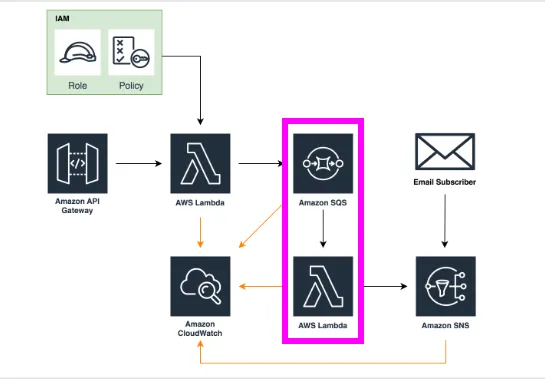


Navigate to the Lambda console and click Create function. On the next screen, select Author from scratch and give the function a name. Select a runtime of Python 3.7 or higher, leave the architecture as default, and then expand the Change default execution role drop-down. Here you want to choose Use an existing role. Under Existing role, find the IAM role we just created and select it, then click Create function.

create function :
-----------------
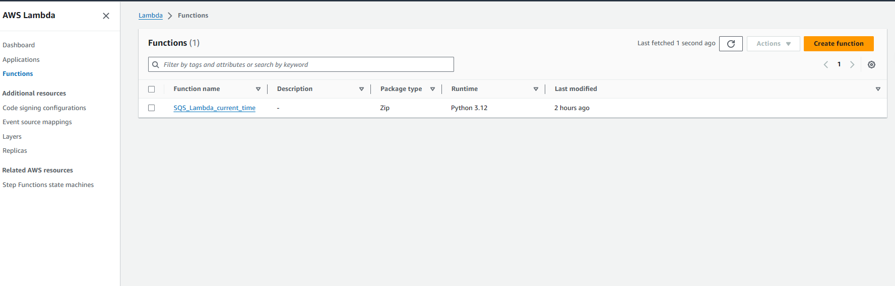

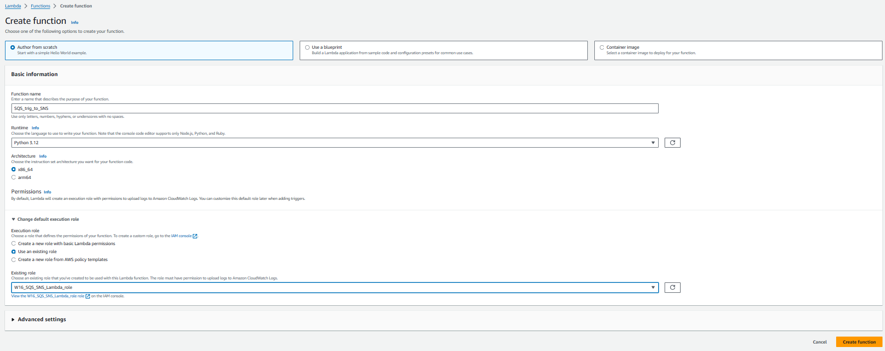

Next we want to add a trigger so that when new messages arrive in the SQS queue, this triggers the Lambda. Click the Add trigger button


For Trigger configuration, find SQS in the drop-down and select it. Then find the SQS queue that was created in the last tutorial. If you have not done that yet, follow this to create a queue. Ensure that Activate trigger is selected, then click Add. You should now see SQS listed as a trigger for this Lambda function.

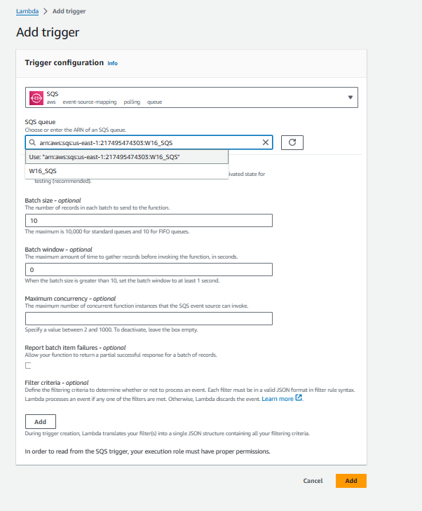

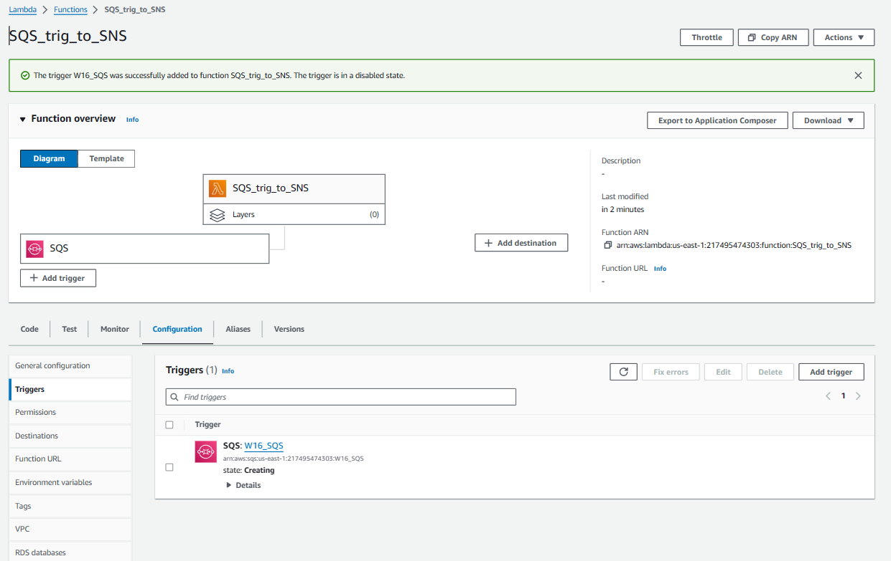

## Modify the Lambda to Publish the SQS Message Trigger to an SNS topic

The Lambda we just created will be triggered by messages received in the SQS queue. Once the Lambda is triggered, it will then publish the message from SQS queue to the SNS topic we created earlier. The email we subscribed to the topic will receive an email notification with the message in it.

To publish the message to the topic, we will write a Python script to run in the Lambda function. Note that it is possible to simply subscribe the SQS queue to the SNS topic, but we are practicing our Lambda and Python skills, so we’re taking a bit of an indirect route to accomplish this objective. Here is the script: <lambda-sns-trigger.py>

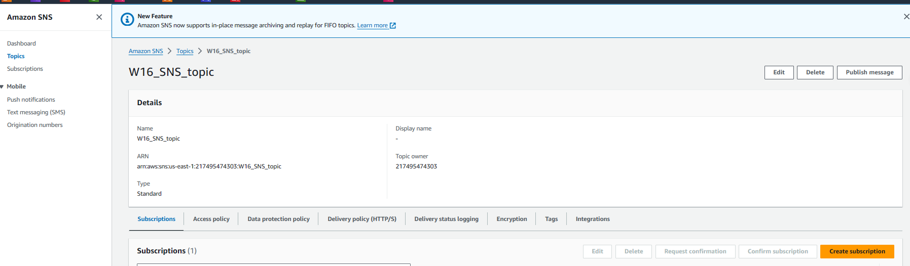

Let me explain a bit about the code above:

import boto3, import json — Imports the Python SDK and JSON library
def lambda_handler(event, context) — Creates a Lambda function; the “event” is the SQS trigger, so we don’t have to hard code or get the SQS client in this function, we simply call event
sns = boto3.client(‘sns’, region_name = ‘<>’) — Call the SNS client and account for the region you want to work in
for message in event[‘Records’]: — Start a for loop to iterate through the ‘Records’ of the event (iterate through the messages of the SQS queue); for detailed information about Amazon SQS message event, go here
print(message) — Prints the message to CloudWatch for tracking purposes; this is optional
body = message[‘body’] — Assign the body variable to the message that is found in the ‘body’ key of the ‘Records’ dictionary
pub_mess = sns.publish(TopicArn: ‘<>’, Message = body) — Calls the sns.publish action, which publishes information to a specific SNS topic; include the TopicArn of the topic you want to publish to; assign the Message as the body variable that we created earlier
print(pub_mess) — This prints the information from the pub_mess variable to CloudWatch for tracking purposes; this is optional
return statement — Returns a status code of 200 if successful
After inserting the code, click the Deploy button.

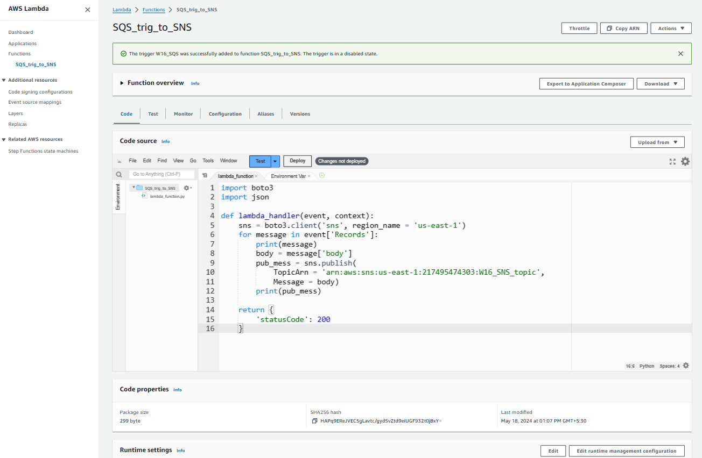

## Validate the Architecture Works

Ok here’s the moment of truth. First, let’s review our architecture again:


- Since we have connected everything, we should be able to simply trigger the API that we created in the first tutorial, and then receive an email notification with the timestamp message we created with the first Lambda. Navigate to the API console and click the API invoke URL.

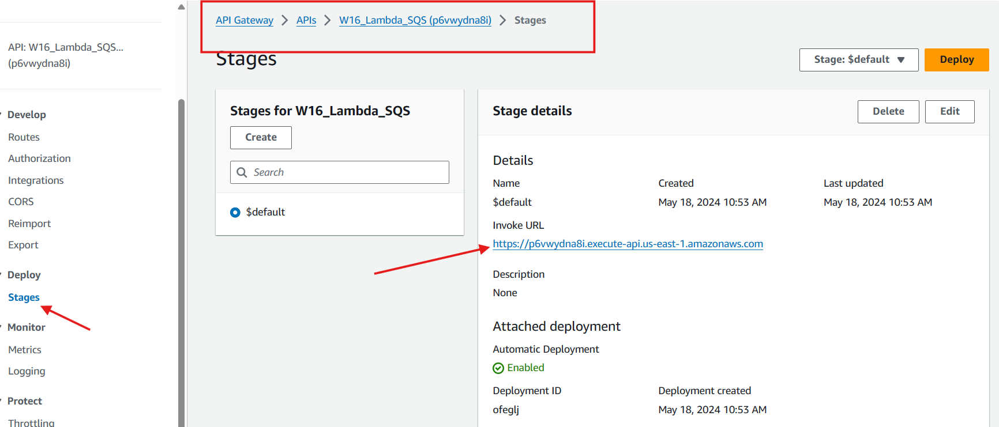

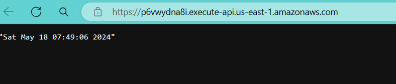

Now navigate to your subscription email and see if you received the SNS email notification with the timestamp message inside.

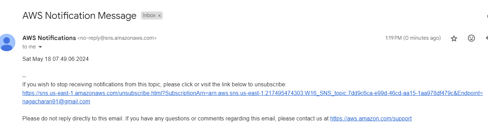

- Notice that the messages match. Perfect! You’re all connected. Thank you for following along with me on this tutorial and I hope you see how these concepts could be useful in real-world situations where you want to send SNS email notifications to clients. There is a more streamlined way to do this entire process, but for this tutorial I wanted to practice my Python code so it made the project a but more tedious. Thank you so much and I’ll see you in the next tutorial!