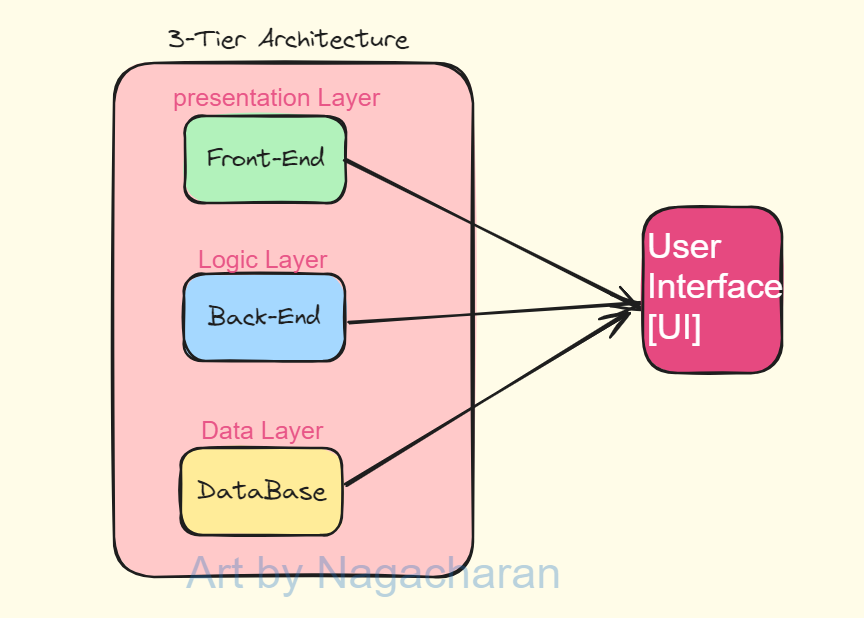
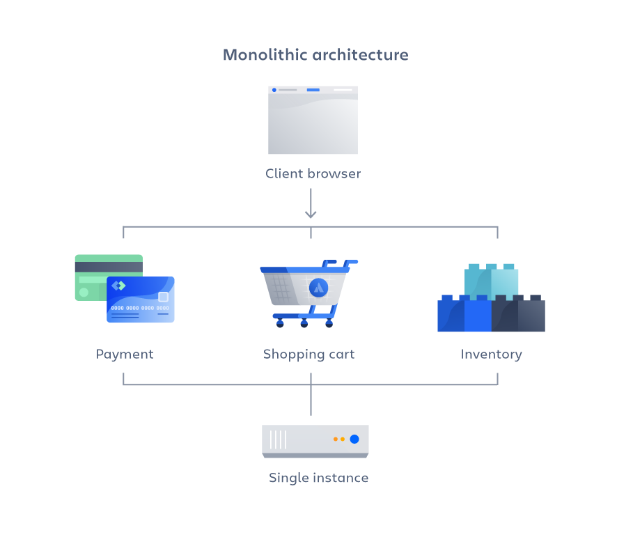
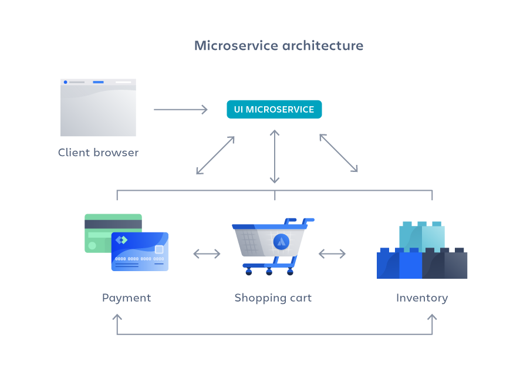

# Deploying an E-Commerce three tier application on AWS EKS

- We will use a demo e-commerce project that sells Robots and AI products. This demo project is created using 12 components that includes 8 micro services, 2 Databases, 1 messaging queue and 1 In memory data store.

Note: All microservices should be in single programming language or multiple programming languages

|Monolithic Architecture|Microservices Architecture|
|---|---|
|A monolithic architecture is a singular, large computing network with one code base that couples all of the business concerns together.|A microservices architecture, also simply known as microservices, is an architectural method that relies on a series of independently deployable services. These services have their own business logic and database with a specific goal. Updating, testing, deployment, and scaling occur within each service|
|To make a change to this sort of application requires updating the entire stack by accessing the code base and building and deploying an updated version of the service-side interface.|Microservices decouple major business, domain-specific concerns into separate, independent code bases|
|This makes updates restrictive and time-consuming.|Microservices don’t reduce complexity, but they make any complexity visible and more manageable by separating tasks into smaller processes that function independently of each other and contribute to the overall whole|
|Monoliths can be convenient early on in a project's life for ease of code management, cognitive overhead, and deployment. This allows everything in the monolith to be released at once.|Adopting microservices often goes hand in hand with DevOps, since they are the basis for continuous delivery practices that allow teams to adapt quickly to user requirements|
|Advantages:  - Easy deployment  - easy Development  -performance  - simplified testing  - easy debugging |Advantages:  - Agility   - flexible scaling  - continuous deployment  - highly maintainable and testable  - Independently deployable  -Technology flexiblity  - High reliability  - Happier teams|
|Disadvantages:  - slower development speed  - scalability  - reliability  - Barrier to technology adoption  - lack of flexibility  - deployment|Disadvantages:  - Development sprawl  - Exponential infrastructure costs  - added organization overhead  - debugging challenge  - lack of standardization  - lack of clear ownership |
|||

For complete project [visit here](https://github.com/charan-happy/robot-shop)

